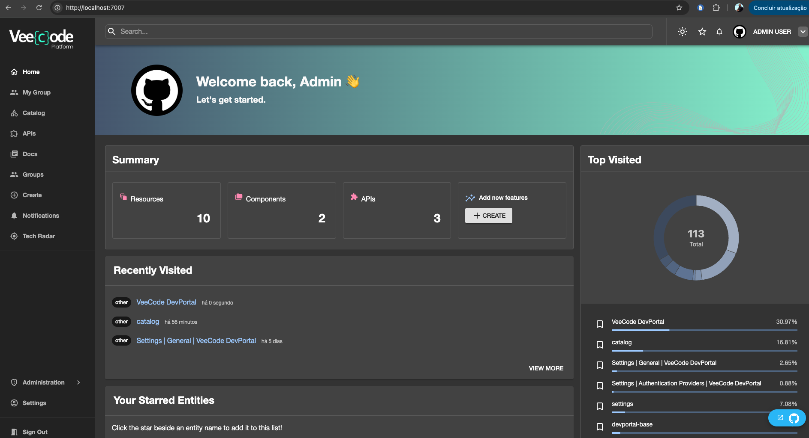

# devportal-distro

VeeCode DevPortal - a Full Backstage Distro ready for production use.

## Overview

VeeCode DevPortal is a fully functional Backstage distro, built on top of the official VeeCode DevPortal base image, ready for production use with several pre-installed plugins.



## Getting Started

You can simply run the following command to start a DevPortal instance locally:

```bash
# check for latest release
docker run --rm --name devportal -d -p 7007:7007 veecode/devportal:1.2.1
```

This will start a DevPortal instance running on http://localhost:7007. The default behavior enables "guest" authentication as an admin user. Of course, the default catalog is useless and you may want to add your own repos, GitHub authentication, etc.

You can use a combination of `docker compose`, configuration files and environment variables to customize the behavior of the DevPortal instance:

```yaml
services:
  devportal:
    image: veecode/devportal:1.2.1
    ports:
      - "7007:7007"
    environment:
      - DEVELOPMENT=true
      - LOG_LEVEL=warn
    volumes:
      - ./app-config.local.yaml:/app/app-config.local.yaml:ro
      - ./dynamic-plugins.yaml:/app/dynamic-plugins.yaml:ro
      - ./dynamic-plugins.default.yaml:/app/dynamic-plugins.default.yaml:ro
```

## How it works

This project creates a derived Docker image from [veecode/devportal-base](https://github.com/veecode-platform/devportal-base) by allowing the addition of dynamic plugins into a new image.

The base image already provides the mechanics for loading plugins dynamically, automatically loading all plugins placed at `dynamic-plugins-root`.

This derived image adds functionality that allows adding more plugins **during build time and during start time**. Added plugins are for optional loading to be determined via configuration files (`dynamic-plugins.yaml` and `dynamic-plugins.default.yaml`).

- **Pre-built plugins are bundled in the image**
  - They are also called "pre-installed plugins"
  - They can be optionally loaded at runtime
  - They can have good defaults defined at `dynamic-plugins.default.yaml`
  - They can be simply enabled or disabled in `dynamic-plugins.yaml`
- **External plugins can be downloaded at start time**
  - You can add plugins from external registries (OCI or NPM) in `dynamic-plugins.yaml`
  - They will be downloaded and extracted into `dynamic-plugins-root` when enabled

The main purpose of this repo is to allow the addition of dynamic plugins to our production distro without the need to build code.

## Features

- Declarative plugin configuration via JSON (for new plugins to be bundled)
- Automatic plugin download and extraction from external registries during build (runtime mechanics)
- Built on top of the official VeeCode DevPortal base image
- Make-based build system for easy customization

## Hot to Build

### 1. Add Dynamic Plugins

Edit the `plugins.json` file to specify which plugins you want to add to your DevPortal image (build time). For example:

```json
{
    "plugins": [
        {
            "name": "@veecode-platform/backstage-plugin-global-floating-action-button-dynamic",
            "version": "1.4.0"
        },
    ]
}
```

Plugins added this way will be downloaded from the NPM registry during the image build process and placed in the appropriate folder for eventual dynamic loading at runtime. **Such plugins are expected to be bundled explicitly as dynamic plugins**.

### 2. Add Wrapper Plugins

Older plugins that were not designed to be loaded dynamically can still be added by wrapping them in a dynamic plugin shell. To do this, create a new dynamic plugin that imports and re-exports the original plugin's functionality, adding the dynamic loading mechanics and configuration accordingly.

There are many "wrapped plugins" available on [RHDH "wrappers" repository](https://github.com/redhat-developer/rhdh/tree/main/dynamic-plugins/wrappers). Most of the dynamic plugins in our "wrappers" folder were copied from there.

### 3. Build the Docker Image

Build your customized DevPortal image:

```bash
docker build -t my-devportal:latest .
```

You can specify a different base image tag:

```bash
docker build --build-arg TAG=v1.2.3 -t my-devportal:v1.2.3 .
```

### 3. Run the Container

```bash
docker run -p 7007:7007 my-devportal:latest
```

## Configuration

Understand the build and runtime folders and behaviours for dynamic plugins:

BUILD TIME:

- The "downloads" and "wrappers" plugins under `dynamic-plugins` workspace are processed and placed at `dynamic-plugins-store` during build.
- The plugins at `dynamic-plugins-store` are copied into the image at `/app/dynamic-plugins` for optional dynamic loading at runtime (they are named **pre-installed plugins**).
- The configuration files `dynamic-plugins.yaml` and `dynamic-plugins.default.yaml` are copied into the image to define its default behaviour and configuration (regarding dynamic plugins).

RUNTIME:

- The file `dynamic-plugins.yaml` is processed:
  - Pre-installed plugins, referenced as local relative paths, are copied to `/app/dynamic-plugins-root` when enabled.
  - Plugins referenced as external registries (OCI or NPM) are downloaded and extracted into `/app/dynamic-plugins-root` when enabled.
  - Enabled plugins have their default configuration merged into `app-config.dynamic-plugins.local.yaml`.
- The base image automatically discovers and loads plugins from `/app/dynamic-plugins-root` (forcibly loaded).

DEPLOY TIME (KUBERNETES):

- Chart mounts `/app/dynamic-plugins-root` as an "emptyDir"
- The `dynamic-plugins.yaml` file is defined by a ConfigMap mounted into the container
- Processing `dynamic-plugins.yaml` is mandatory and done by an initContainer, populating `/app/dynamic-plugins-root`.

## Build Arguments

- **TAG**: The tag of the base image to use (default: `1.1.12`)

Example:

```bash
docker build --build-arg TAG=v1.0.0 -t my-devportal:v1.0.0 .
```

## Troubleshooting

### Build Fails During Plugin Download

- Verify the plugin package name is correct
- Check that the specified version exists on NPM
- Ensure your network can access the NPM registry
- Ensure `jq` is available in the build environment

### Plugin Not Loading at Runtime

- Verify the plugin was downloaded and copied (check build logs)
- Ensure the base image version supports your plugins
- Check the plugin is correctly listed in `plugins.json`

## Contributing

Contributions are welcome! Please feel free to submit issues or pull requests.

## License

This project is licensed under the Apache License 2.0 - see the [LICENSE](LICENSE) file for details.

## Related Projects

- [veecode-platform/devportal-base](https://github.com/veecode-platform/devportal-base) - Base DevPortal image
- [Backstage](https://backstage.io/) - The platform DevPortal is built on
